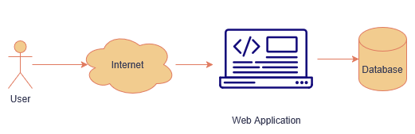
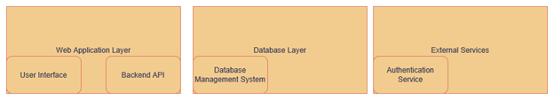

# SeniorProjectPortfolio
GCU Senior Project Portfolio
## Project Overview
This project is a comprehensive business management system designed to handle employee, product, product category, supplier, customer, and user information. It was developed using Java 17 with the Spring Boot framework, utilizing Thymeleaf for the frontend, Maven for build management, and JPA with a MySQL database for data persistence. Initially, I considered using C# with WebForms; however, upon my professor's advice, I shifted to a web application approach to better suit the needs of a business environment. The project utilizes BCrypt to securely hash and encode user passwords, ensuring robust security for user authentication.

## Tools Needed
- Java 17
- Spring Boot 3.3
- Maven
- MySQL
- MAMP
- Postman

## JSON Example
```
{
  "productId": 1,
  "name": "Product Name",
  "description": "Product Description",
  "categoryId": 1,
  "quantity": 100,
  "reorderLevel": 10,
  "supplierId": 1,
  "purchasePrice": 99.99,
  "sellPrice": 129.99
}
```

## Code Snippet
```
package com.example.demo.controller;

import com.example.demo.entity.CustomerEntity;
import com.example.demo.entity.ProductCategoryEntity;
import com.example.demo.entity.ProductEntity;
import com.example.demo.entity.SupplierEntity;
import com.example.demo.entity.UserEntity;
import com.example.demo.service.ProductCategoryService;
import com.example.demo.service.ProductService;
import com.example.demo.service.SupplierService;

import org.springframework.beans.factory.annotation.Autowired;
import org.springframework.stereotype.Controller;
import org.springframework.ui.Model;
import org.springframework.validation.BindingResult;
import org.springframework.validation.annotation.Validated;
import org.springframework.web.bind.annotation.*;

import java.util.List;

/**
 * Controller for managing product-related operations on the Product Page (/products).
 */
@Controller
@RequestMapping("/products")
public class ProductsController {
    
    @Autowired
    // Service for handling product-related business logic
    private ProductService productService;
    
    @Autowired
    // Service for handling supplier-related business logic
    private SupplierService supplierService;
    
    @Autowired
    // Service for handling product category-related business logic
    private ProductCategoryService productCategoryService;

    /**
     * Handles GET requests to retrieve and display a list of products and suppliers.
     * 
     * @param model the model to hold attributes for the view
     * @return the name of the view to render the product list
     */
    @GetMapping
    public String listProducts(Model model) {
        // Fetch all products from the product service
        List<ProductEntity> products = productService.findAll();
        model.addAttribute("products", products);
        
        // Fetch the list of suppliers and add to the model
        List<SupplierEntity> suppliers = supplierService.findAll();
        model.addAttribute("suppliers", suppliers);
        
        // Fetch the list of product categories and add to the model
        List<ProductCategoryEntity> productCategories = productCategoryService.findAll();
        model.addAttribute("productCategories", productCategories);
        
        return "products/list"; // Return the view name for the product list
    }

    /**
     * Displays the form for creating a new product.
     * 
     * @param model the model to hold attributes for the view
     * @return the name of the view to render the product form
     */
    @GetMapping("/new")
    public String createProductForm(Model model) {
        // Add a new ProductEntity object to the model for the form
        model.addAttribute("product", new ProductEntity());
        
        List<SupplierEntity> suppliers = supplierService.findAll();
        model.addAttribute("suppliers", suppliers);
        
        
        List<ProductCategoryEntity> productCategories = productCategoryService.findAll();
        model.addAttribute("productCategories", productCategories);
        
        return "products/create"; // Return the view name for the product form
        
        
    }

    /**
     * Saves a product to the database. 
     * 
     * @param product the ProductEntity to save to the database
     * @return a redirect to the product list page
     */
    @PostMapping("/new")
    public String saveProduct(@ModelAttribute ProductEntity product) {
    	//save the product to the database
    	productService.save(product);
    	
        return "redirect:/products"; // Redirect to the product list page
    }

    /**
     * Displays the form for editing an existing product.
     * 
     * @param id the ID of the product to edit
     * @param model the model to hold attributes for the view
     * @return the name of the view to render the product form
     */
    @GetMapping("/edit/{id}")
    public String editProductForm(@PathVariable Long id, Model model) {
        // Fetch the product by ID and add it to the model
        ProductEntity product = productService.findById(id);
        
        // Fetch the list of suppliers and add to the model
        List<SupplierEntity> suppliers = supplierService.findAll();
        model.addAttribute("suppliers", suppliers);
        
        // Fetch the list of suppliers and add to the model
        List<ProductCategoryEntity> productCategories = productCategoryService.findAll();
        model.addAttribute("productCategories", productCategories);
        
        model.addAttribute("product", product);
        return "products/edit"; // Return the view name for the product form
    }
    
    @PostMapping("/edit/{id}")
    public String updateUser(@PathVariable Long id, @ModelAttribute @Validated ProductEntity product, BindingResult result, Model model) {
        if (result.hasErrors()) {
            model.addAttribute("pageTitle", "Edit Product");
            List<ProductEntity> products = productService.findAll();
            model.addAttribute("products", products);
            //return "user/form";
            return "products/edit";
        }
        // Set the ID to ensure the user is updated
        //user.setUserID(id);
        System.out.print("in @PostMapping(\"/edit/{id}\")");
        productService.save(product);
        return "redirect:/products";
    }

    /**
     * Deletes a product by its ID.
     * 
     * @param id the ID of the product to delete
     * @return a redirect to the product list page
     */
    @PostMapping("/delete/{id}")
    public String deleteProduct(@PathVariable Long id) {
        // Delete the product by ID using the product service
        productService.deleteById(id);
        return "redirect:/products"; // Redirect to the product list page
    }
    
    /**
     * Searches database by product name or description and returns results
     * @param query the string containing the search term
     * @param searchType the button selected (name or description)
     * @param model the model to hold attributes for the view
     * @return list of all products that fit the search term
     */
    @GetMapping("/search")
    public String searchProducts(@RequestParam String query,
                                  @RequestParam String searchType,
                                  Model model) {
        List<ProductEntity> products;
        
        List<SupplierEntity> suppliers = supplierService.findAll();
        model.addAttribute("suppliers", suppliers);
        
        List<ProductCategoryEntity> productCategories = productCategoryService.findAll();
        model.addAttribute("productCategories", productCategories);

        // if user selects to search by product name
        if ("name".equalsIgnoreCase(searchType)) {
        	products = productService.findByNameContainingIgnoreCase(query);

        // or if they select to search by product  description
        } else if ("description".equalsIgnoreCase(searchType)) {
        	products = productService.findByDescriptionContainingIgnoreCase(query);
        	
        // Default to fetching all if searchType is unrecognized
        } else { 
        	products = productService.findAll();
        }

        model.addAttribute("products", products);
        return "products/list";
    }
}
```

*Anticipated Workflow*


*Logical Depiction of the System*



*Physical Depiction of the System*


## Quick Installation Guide

This guide provides step-by-step instructions to set up the project locally.
### Prerequisites

- Java Development Kit (JDK) 17 or higher
- Maven 3.6 or higher
- MySQL Server (version 8 or compatible)
- An IDE such as IntelliJ IDEA or Eclipse (I used Spring Boot 3.3)
- MAMP

Step 1: Clone the Repository

git clone https://github.com/JFishProgramming/SeniorProject.git

Step 2: Import this MySQL Database with MAMP

[seniorproject.sql](seniorproject.sql)

Step 3: Update the application.properties file with your database credentials:
```
spring.datasource.url=jdbc:mysql://localhost:3306/your_database_name
spring.datasource.username=your_username
spring.datasource.password=your_password
spring.jpa.hibernate.ddl-auto=update
```
Step 4: Build the Project

`mvn clean install`

Step 5: Run the Application

`mvn spring-boot:run`

Step 6: Access the Application

Open your browser and navigate to:
http://localhost:8080
