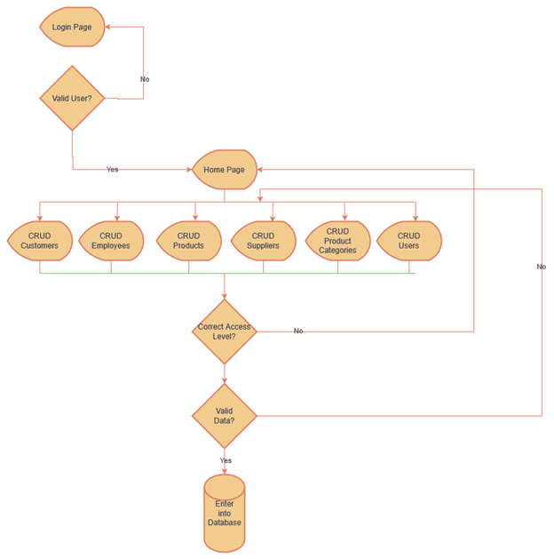

# SeniorProjectPortfolio
GCU Senior Project Portfolio
## Project Overview
This project is a comprehensive business management system designed to handle employee, product, product category, supplier, customer, and user information. It was developed using Java 17 with the Spring Boot framework, utilizing Thymeleaf for the frontend, Maven for build management, and JPA with a MySQL database for data persistence. Initially, I considered using C# with WebForms; however, upon my professor's advice, I shifted to a web application approach to better suit the needs of a business environment. The project utilizes BCrypt to securely hash and encode user passwords, ensuring robust security for user authentication.

## Tools Needed
- Java 17
- Spring Boot 3.3
- Maven
- MySQL
- MAMP
- Postman

## JSON Example
```
{
  "productId": 1,
  "name": "Product Name",
  "description": "Product Description",
  "categoryId": 1,
  "quantity": 100,
  "reorderLevel": 10,
  "supplierId": 1,
  "purchasePrice": 99.99,
  "sellPrice": 129.99
}
```

Anticipated Workflow


## Quick Installation Guide

This guide provides step-by-step instructions to set up the project locally.
### Prerequisites

- Java Development Kit (JDK) 17 or higher
- Maven 3.6 or higher
- MySQL Server (version 8 or compatible)
- An IDE such as IntelliJ IDEA or Eclipse (I used Spring Boot 3.3)

Step 1: Clone the Repository

git clone https://github.com/JFishProgramming/SeniorProject.git

Step 2: Import this MySQL Database

[seniorproject.sql](seniorproject.sql)

Step 3: Update the application.properties file with your database credentials:
```
spring.datasource.url=jdbc:mysql://localhost:3306/your_database_name
spring.datasource.username=your_username
spring.datasource.password=your_password
spring.jpa.hibernate.ddl-auto=update
```
Step 4: Build the Project

`mvn clean install`

Step 5: Run the Application

`mvn spring-boot:run`

Step 6: Access the Application

Open your browser and navigate to:
http://localhost:8080
